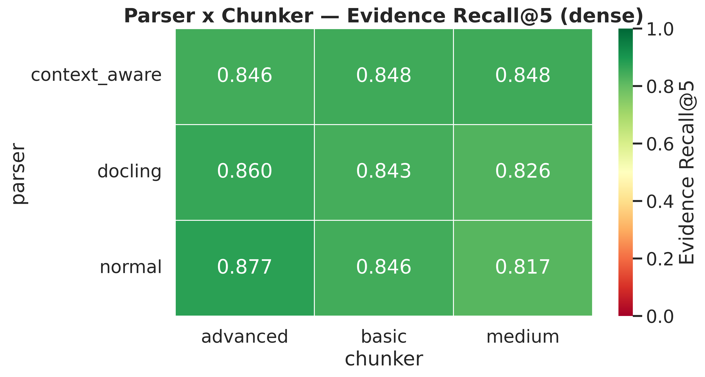
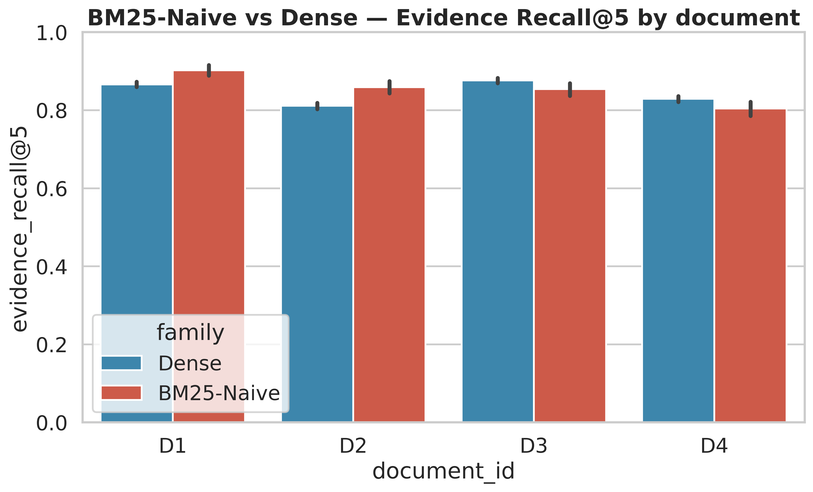
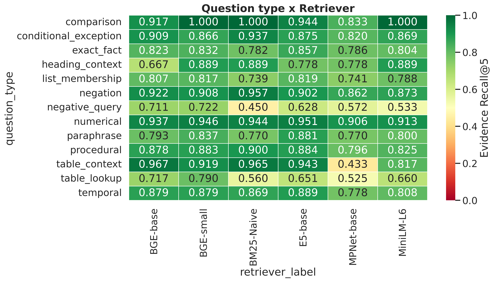
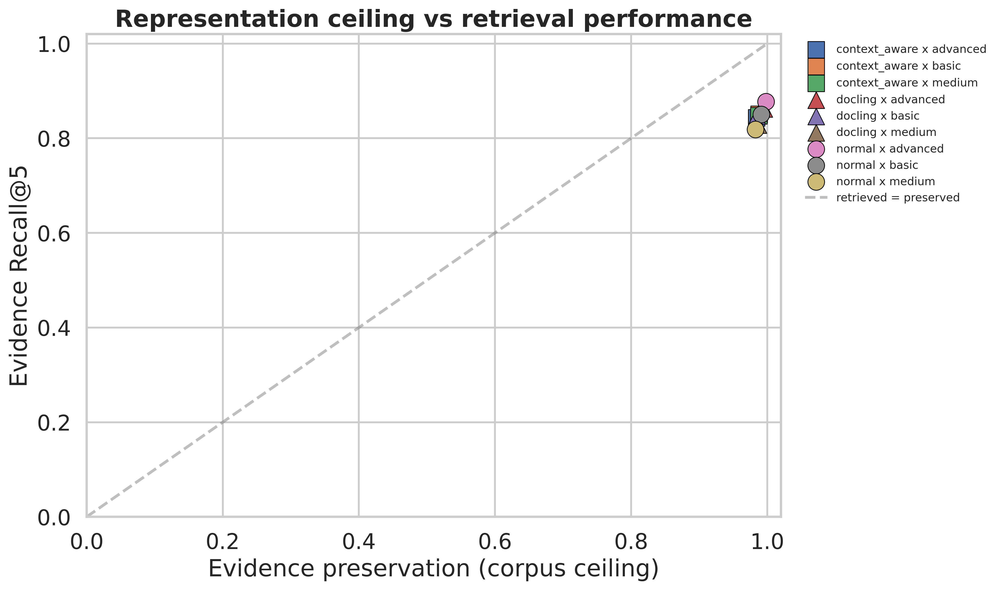
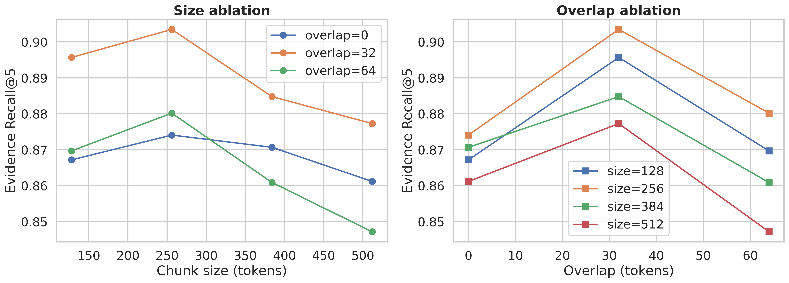
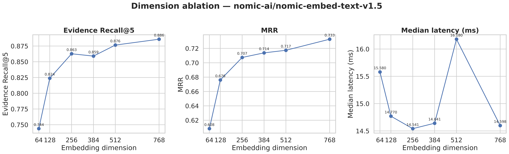
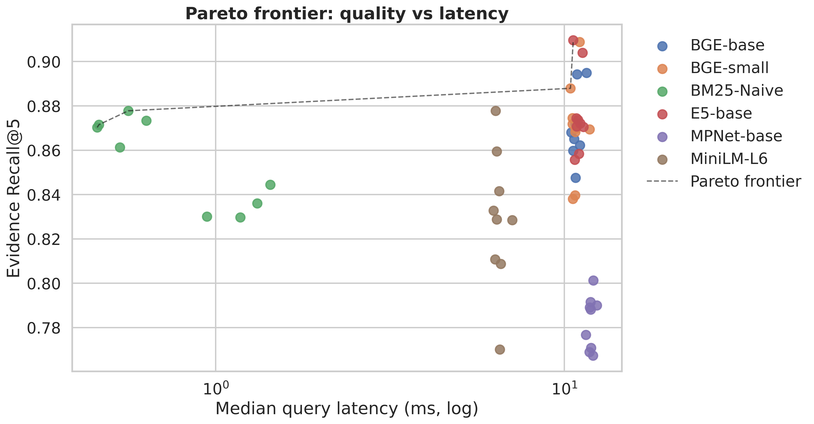

# Parser, Chunking, and Embedding Interactions in Retrieval-Augmented Generation over Indian Government Regulatory Documents

[](LICENSE)

A controlled factorial study of parser × chunker × embedding interactions for RAG retrieval over structurally diverse Indian central-government regulatory documents.

---

## 📌 Overview

RAG pipelines are typically assembled from independently-chosen components — a document parser, a chunking strategy, and an embedding model — yet these choices are rarely evaluated **jointly**, and evaluations that do combine them are usually run on a single document or corpus.

This repository contains:

- The complete factorial evaluation harness (`pre_generation_rag_retrieval_benchmark.py`)
- A **3 × 3 × 5** parser × chunker × embedding sweep with a BM25 sparse baseline
- An **800-question** evidence-annotated benchmark across four structurally distinct Indian regulatory documents
- Linear mixed-effects statistical modeling with Holm-corrected paired comparisons
- Clustered bootstrap confidence intervals for all **54 unique retriever configurations**
- Embedding-dimension and chunk-size/overlap ablations
- Efficiency/quality Pareto analysis

The result set contains **72,000 query-level evaluations**, all included in the supplementary release.

---

## 🧠 Experimental Design

### Corpus (4 documents, single domain)

| ID | Document | Authority | Structural Character |
|----|----------|-----------|----------------------|
| D1 | Central Civil Services (Leave) Rules, 1972 | DoPT | Numerical entitlement tables, accrual/encashment schedules |
| D2 | CCS (Conduct) Rules, 1964 | DoPT | Prescriptive prohibitions, disciplinary language |
| D3 | Fundamental Rules & Supplementary Rules, Part I | DoPT | Large heterogeneous multi-chapter rule hierarchy |
| D4 | Right to Information Act, 2005 | Parliament of India | Long-form legal narrative, definitions, cross-references |

### Parsers (3)

- **normal** — raw per-page text extraction (pypdf), split on blank-line boundaries
- **context-aware** — heading-injection via rule-based pattern; each body element prefixed with its most recent heading tag
- **docking** — layout-aware conversion to Markdown (docling), split into blocks

### Chunkers (3)

- **basic** — fixed-size 256-token windows, no overlap
- **medium** — recursive / sentence-boundary-aware, 256-token target, 48-token tail overlap
- **advanced** — hierarchical section-aware chunking with `[Doc: {id} | Section: {heading}]` breadcrumb prefixes

### Retrievers (5 dense + 1 sparse)

| Model | Tier | Training regime |
|-------|------|-----------------|
| all-MiniLM-L6-v2 | small | general |
| all-mpnet-base-v2 | base | general |
| bge-small-en-v1.5 | small | retrieval-tuned |
| bge-base-en-v1.5 | base | retrieval-tuned |
| e5-base-v2 | base | retrieval-tuned |
| BM25-Naive | — | sparse baseline |

All dense retrieval uses exact inner-product search (FAISS `IndexFlatIP`) over L2-normalized embeddings with model-appropriate query/passage prefixes.

---

## 🔍 Metrics

For each query with *m* required evidence strings and retrieved top-*k* chunks:

- **Evidence Recall@k** — fraction of evidence strings matched by the top-*k* union (primary outcome: `recall_10`)
- **Hit@k** / **Full@k** — whether at least one, or all, evidence strings are matched
- **MRR** — reciprocal rank of the first matching chunk
- **nDCG@5, nDCG@10** — discounted cumulative gain over newly-matched evidence
- **Evidence Coverage** — corpus-level preservation audit

Evidence matching: a chunk satisfies a required-evidence string if the whitespace-normalized, lower-cased string appears as a substring, **or** ≥ 80% of its tokens are present in the chunk.

---

## 📊 Statistical Methodology

**Linear mixed-effects models** on `recall_10` with random intercept per (document, query) pair:

```text
recall_10 ~ Parser * Chunker * Embedding + (1 | query)   [dense,  n = 45 cells]
recall_10 ~ Parser * Chunker               + (1 | query)   [BM25,   n = 9  cells]
```

**Holm-corrected paired comparisons** between each dense configuration and its query-matched BM25-Naive counterpart on the same (document, parser, chunker). **Clustered bootstrap 95% CIs** (2,000 resamples over query-level means) for all 54 unique configurations.

---

## 🧪 Key Findings

### (RQ1) Parser × Chunker interact significantly

The best-performing combination is **not predictable** from either component's individual ranking.


*Figure 1: Mean dense Evidence Recall@5 by parser and chunker, averaged over all five embedding models and four documents.*

**Significant fixed effects** (dense 3×3×5 mixed-effects model, reference = context-aware / basic / BGE-base):

| Term | Coef. | SE | z | p |
|------|-------|----|----|----|
| Intercept | 0.905 | 0.010 | 88.86 | < 0.0001 |
| Parser[normal] | +0.039 | 0.012 | 3.17 | 0.0015 |
| Chunker[medium] | +0.028 | 0.012 | 2.25 | 0.0247 |
| Embedding[MPNet-base] | −0.049 | 0.012 | −3.93 | < 0.0001 |
| Chunker[medium] × Embedding[MiniLM-L6] | −0.035 | 0.018 | −1.97 | 0.0493 |
| Parser[docking] × Chunker[medium] | −0.047 | 0.018 | −2.69 | 0.0073 |
| Parser[normal] × Chunker[medium] | −0.077 | 0.018 | −4.39 | < 0.0001 |

### (RQ2) No single retriever family dominates across documents


*Figure 2: Evidence Recall@5, dense (best-of-5 mean) vs. BM25-Naive, per document.*

- **BM25 wins** on D1 and D2
- **Dense wins** on D3 and D4
- Several per-cell differences remain significant after Holm correction (e.g. D2/docking/basic/MPNet-base: BM25 = 0.92 vs dense = 0.71, *p*<sub>Holm</sub> < 0.0001)
- Three of five embeddings (E5-base, BGE-base, BGE-small) beat matched BM25 in **72–86%** of parser/chunker cells

**Conclusion:** sparse-vs-dense should be validated *per document*, not assumed from an aggregate leaderboard.

### (RQ3) MPNet-base has a specific, reproducible weakness


*Figure 3: Evidence Recall@5 by question type and retriever.*

- MPNet-base collapses on **table_context** questions (0.433 vs. 0.82–0.97 for every other retriever)
- `table_lookup` and `negative_query` are structurally the hardest categories for *all* retrievers
- The weakness is consistent across all three parsers — not an artifact of any single preprocessing choice

### (RQ4) Near-saturated evidence preservation ceiling


*Figure 4: Evidence Recall@5 vs. corpus-level evidence preservation for every parser × chunker combination.*

Corpus-level mean evidence coverage ranges from **0.983 to 0.998** across all nine parser/chunker combinations; the fraction of queries with complete coverage ranges from 0.980 to 0.996.

**This means retrieval-quality differences are driven almost entirely by ranking quality, not by information loss during ingestion.** Parsers and chunkers all preserve source text well — they differ in how *retrievable* that preserved text is.

---

## ⚖️ Ablations

### Chunk size / overlap


*Figure 5: Chunk size / overlap ablation, Evidence Recall@5.*

- **Overlap of 32 tokens dominates** both 0 and 64 at every chunk size tested
- Best combination: **256-token chunks / 32-token overlap** (Recall@5 ≈ 0.90)
- Larger chunks (384, 512) do **not** improve over 256 — suggesting 256 is near a local optimum

### Embedding dimension


*Figure 6: Embedding dimension vs. Evidence Recall@5, MRR, and median query latency (Matryoshka-truncatable nomic-embed-text-v1.5, under the pre-declared normal/advanced selection).*

- Recall@5 rises from **0.744 at 64-dim** to **0.886 at 768-dim**
- **Most gain is realized by 256-dim** (0.863)
- Median latency is **flat** across dimensions (14.5–16.2 ms) — the dominant cost of higher dimensionality is *index storage*, not per-query latency
- Practitioners can truncate well below 768-dim with only modest quality cost

### Efficiency / quality Pareto


*Figure 7: Quality/latency Pareto frontier across all 54 configurations.*

- BM25 configurations dominate the low-latency region (sub-millisecond median latency) at modest recall cost
- `docling + advanced` with BGE-small or E5-base anchor the high-quality end
- **No configuration achieves both highest recall and lowest latency** — this is a genuine trade-off, not a dominated alternative

---

## 📈 RQ4 Summary Table

| Dimension | Finding |
|-----------|---------|
| Chunk size | 256 tokens is near-optimal; larger sizes underperform |
| Overlap | 32 tokens dominates 0 and 64 at all sizes |
| Embedding dim (Recall@5) | 64 → 0.744, 256 → 0.863, 768 → 0.886 |
| Embedding dim (MRR) | 64 → 0.608, 768 → 0.733 |
| Latency vs. dim | Flat (~14.5–16.2 ms) — storage cost dominates, not query cost |

---

## 🚀 Running the Benchmark

```bash
python pre_generation_rag_retrieval_benchmark.py
```

The script will:

1. Automatically install dependencies (pypdf, docling, sentence-transformers, faiss-cpu, rank_bm25, statsmodels, etc.)
2. Parse all four PDFs with the three parsers (cached to `parsers.pkl`)
3. Build chunk sets for all parser × chunker combinations
4. Run the full retriever sweep (54 unique configurations, checkpointed)
5. Fit mixed-effects models and paired Holm-corrected comparisons
6. Compute clustered bootstrap CIs (2,000 resamples)
7. Run the embedding-dimension and chunk-size/overlap ablations
8. Generate all 14 figures and 12 result CSVs

All outputs are written to `benchmark_v12_evidence_recall_v1/` (figures in `figures/`).

### Requirements

- Python 3.9
- Pinned versions in `requirements.txt` (released alongside the code)
- Package set: `sentence-transformers`, `faiss-cpu`, `rank_bm25`, `statsmodels`, `docling`, `pypdf`, `tiktoken`, `nltk`, `einops`, `matplotlib`, `seaborn`, `scipy`

All embedding models are used with their published query/passage prompt prefixes where applicable (BGE, E5) and without any prefix otherwise (MiniLM, MPNet).

---

## 📁 Repository Structure

```text
pre_generation_rag_retrieval_benchmark/
│
├── pre_generation_rag_retrieval_benchmark.py    # Full harness + factorial sweep
├── requirements.txt                             # Pinned dependency versions
├── README.md
│
├── fig3_parser_x_chunker.png
├── fig4a_dense_embeddings.png
├── fig4b_dense_vs_bm25naive.png
├── fig5_per_document_family.png
├── fig6_per_document.png
├── fig7_question_type.png
├── fig8_latency_vs_quality.png
├── fig9_bootstrap_forest.png
├── fig10_parser_x_retriever.png
├── fig11_3d_scatter.png
├── fig12_representation_ceiling.png
├── fig13_dimension_ablation.png
├── fig14_chunk_size_overlap_ablation.png
├── fig15_pareto_frontier.png
├── fig16_design_decision_map.png
│
├── master_results.csv
├── table3a_dense.csv
├── table3b_bm25naive.csv
├── table4_per_document.csv
├── table5_question_type.csv
├── table6_dense_vs_bm25naive.csv
├── mixedlm_dense_3x3x5.csv
├── mixedlm_bm25naive_3x3.csv
├── bootstrap_ci_clustered.csv
├── paired_dense_vs_bm25naive_holm.csv
├── dense_vs_bm25naive_summary.csv
├── audit_coverage.csv
├── audit_ceiling.csv
├── dimension_ablation.csv
├── table_dimension_ablation.csv
├── chunk_size_overlap_ablation.csv
├── table_chunk_size_overlap_ablation.csv
└── efficiency_pareto.csv
```

---

## 🎯 Design Objective

This benchmark is **retrieval-only by design** — we deliberately exclude a generation stage so that parser/chunker/embedding effects on retrieval are not confounded with generator behavior.

The benchmark is intended to support:

- **RAG practitioners** assembling pipelines over structured regulatory or policy documents
- **Retrieval researchers** studying parser/chunker/embedding interactions under matched comparisons
- **Benchmark designers** interested in evidence-preservation audits that separate representation loss from ranking failure
- **Framework authors** deciding on defaults for chunking and embedding selection

### Headline Implications for Practitioners

1. **Parser × chunker interaction dominates** more than either component's individual ranking. Heading-injection (context-aware parser) can *underperform* simpler extraction combined with structure-aware chunking when the chunker already performs its own section detection.
2. **Embedding model selection should be validated per-document**, not assumed from an aggregate leaderboard. MPNet-base is a significant, specific liability on tabular content in our regulatory setting.
3. **The near-saturated representation ceiling is itself informative:** for this class of document, parsing and chunking are largely a *solved problem* for information preservation. The open problem is **ranking**.

---

## ⚠️ Limitations

- **Four documents, single domain.** All four documents are Indian central-government administrative/legal texts. Findings should not be assumed to transfer to other domains (scientific literature, customer-support KBs) or languages without further validation.
- **LLM-generated questions.** Question-evidence pairs were generated by an LLM under a fixed verbatim-evidence-constrained schema, with a 10% manual spot-check and de-duplication pass — not fully human-authored, and not subjected to formal inter-annotator agreement measurement. We report this plainly rather than presenting the benchmark as a fully human-curated gold standard.
- **No generation-stage evaluation.** This study is retrieval-only. Whether improved retrieval translates into better final answers is a natural extension (“Experiment B”, following RAGAS/RAGChecker-style two-stage designs) left to future work.
- **Near-ceiling evidence preservation** limits discriminative power for parser/chunker comparisons *specifically at the corpus-coverage level*; reported parser/chunker effects should be interpreted as effects on **ranking**, not on what content survives ingestion.
- **No cross-encoder reranking stage or hybrid (sparse+dense) baseline** was evaluated. Given that no single family dominates across documents, a lightweight hybrid or reranking stage is a natural next comparison point.

---

## 📌 Contribution Summary

- Joint **parser × chunker × embedding** factorial evaluation over Indian government regulatory text
- **800-question, four-document** evidence-annotated benchmark with automated + sampled manual validation
- **Linear mixed-effects modeling** with query-level random intercepts on a 72,000-row result set
- **Holm-corrected paired comparisons** between matched dense and sparse configurations
- **Clustered bootstrap 95% CIs** for all 54 unique retriever configurations
- **Corpus-level representation-ceiling audit** that separates retrieval failure from ingestion information loss
- **Embedding-dimension** and **chunk-size/overlap** ablations with a **pre-declared selection rule** to avoid post-hoc cherry-picking
- **Efficiency/quality Pareto analysis** with an explicit cost proxy

---

## 🔗 Reproducibility

The complete implementation is publicly available at [github.com/shubham-61291/pre_generation_rag_retrieval_benchmark](https://github.com/shubham-61291/pre_generation_rag_retrieval_benchmark).

- Configuration hash, checkpointed run cache, and full per-query result tables (`master_results.csv`, 72,001 rows) are included in the supplementary release
- Corpus manifest with source URLs, retrieval dates, and SHA-256 hashes of the exact PDF bytes is released alongside the code
- All experiments can be reproduced by running the script with Python 3.9 and the listed dependencies

---


---

## 🏗️ Author

Designed and implemented by **Shubham Kumar Singh**.

---

## 📄 License

This project is licensed under the Apache License, Version 2.0. See the `LICENSE` file for details.
